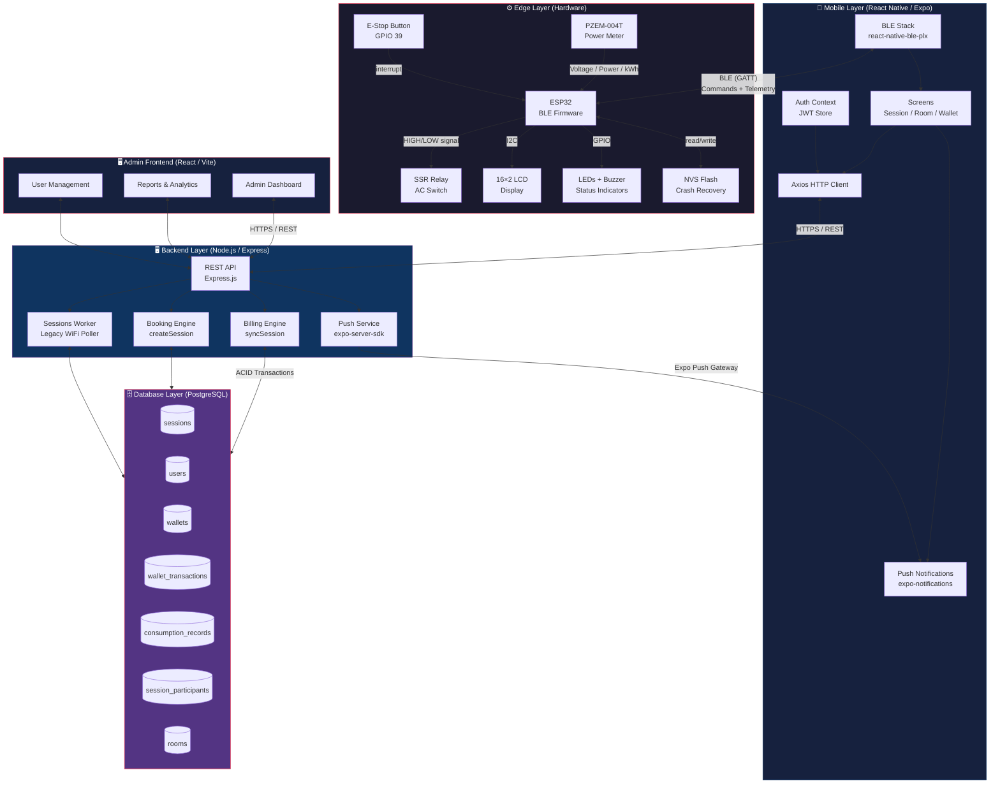
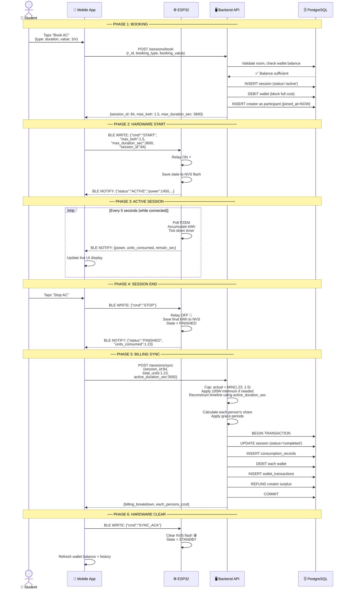
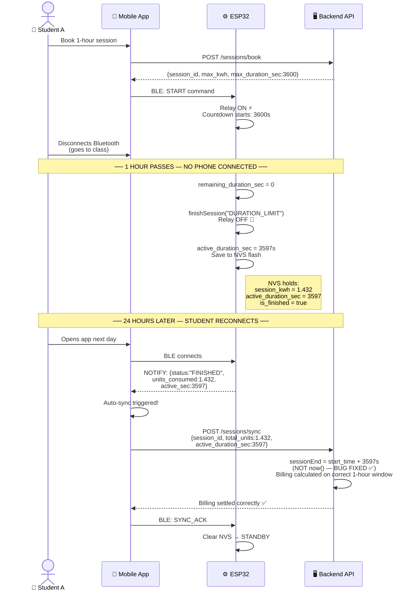
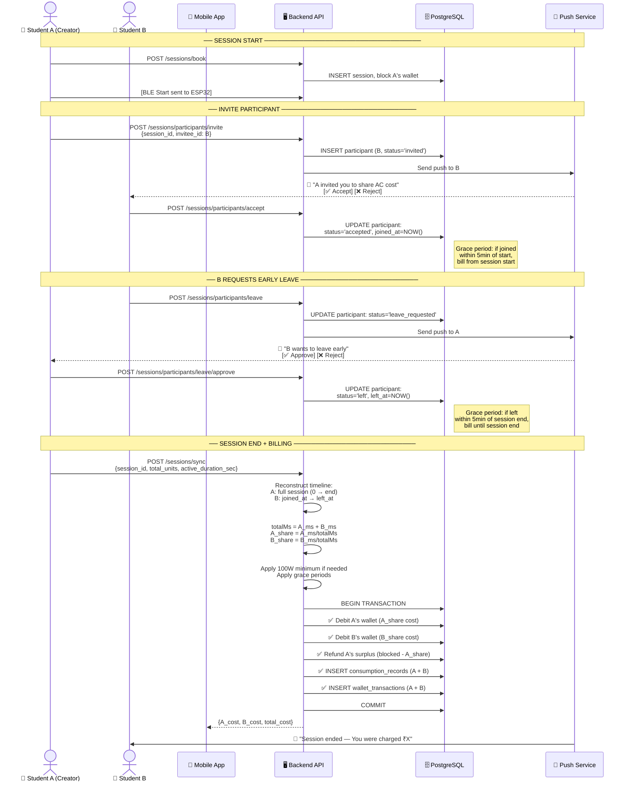
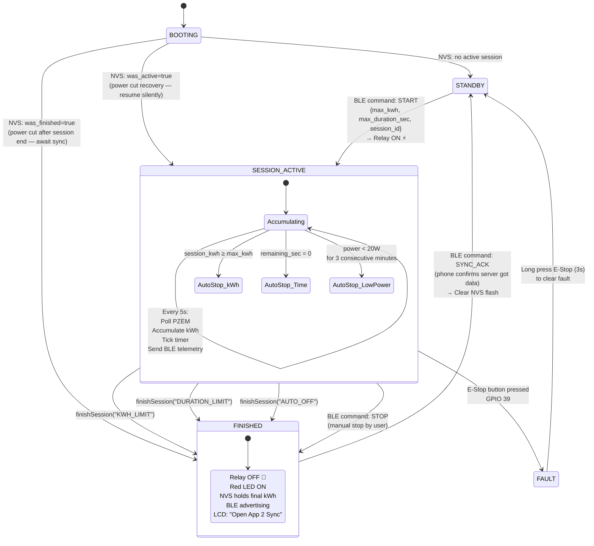
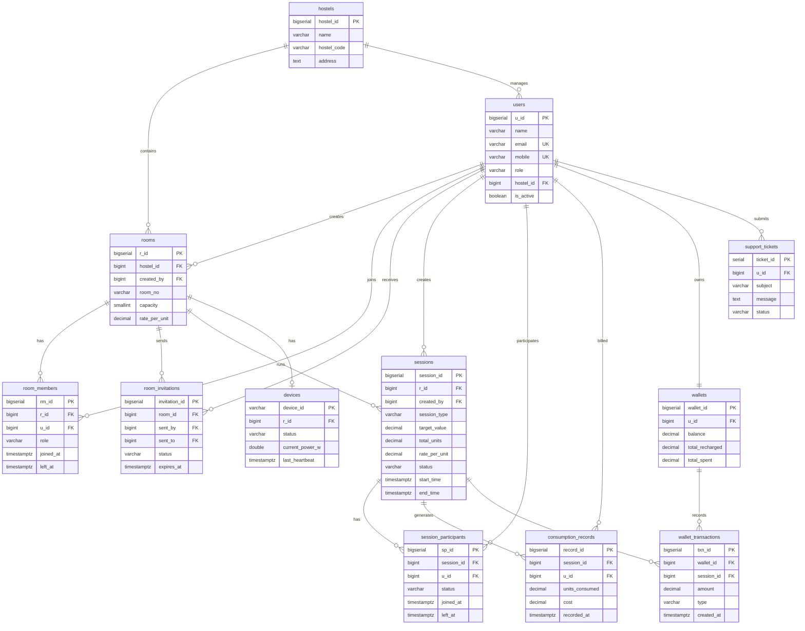
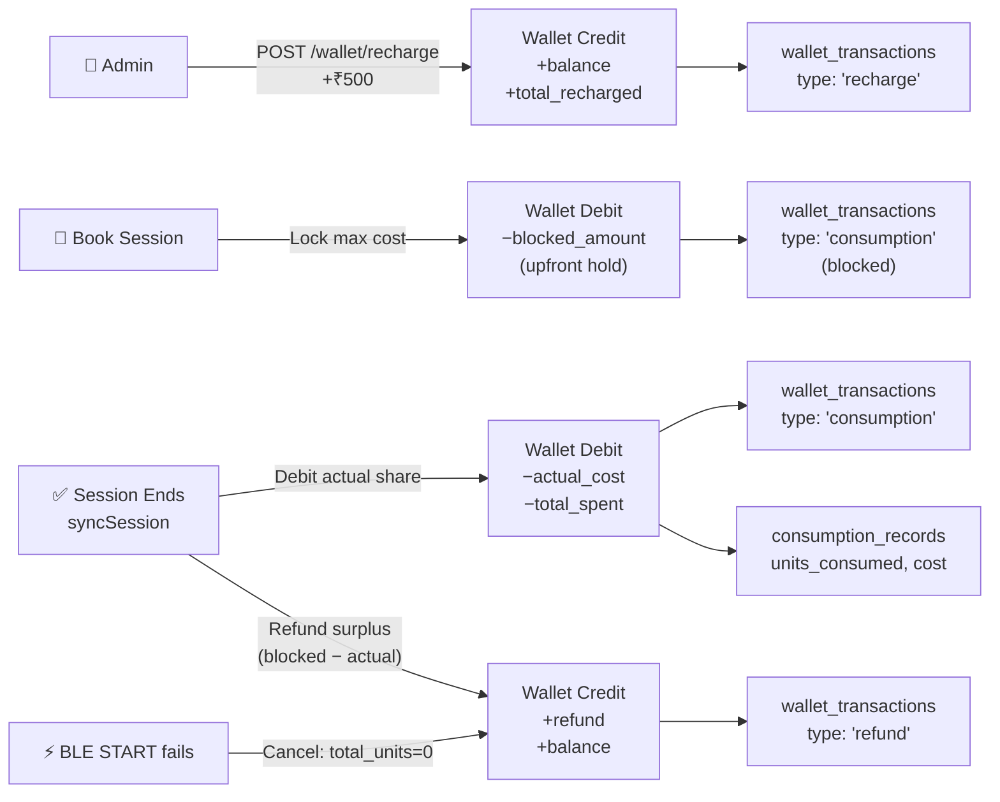
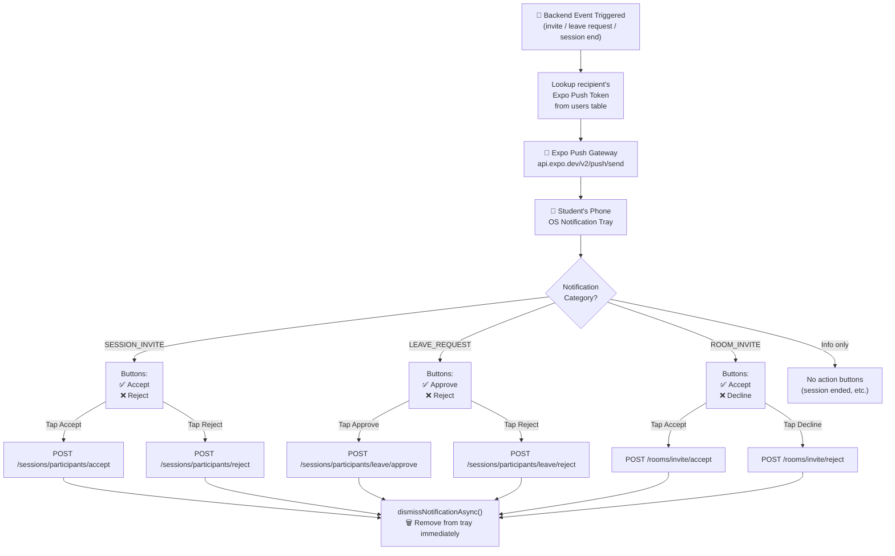
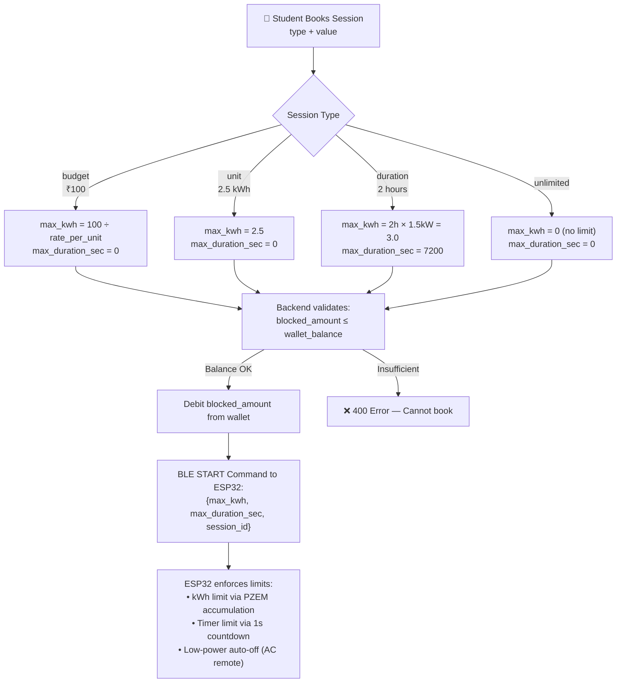

# FairAC — Full System Architecture Diagram

> **Version 1.0 — With Pending Bug Fixes Applied**
> Assumes: `active_duration_sec` fix, grace periods, and 100W minimum in `syncSession`.

---

## Diagram 1 — High-Level System Overview

---

## Diagram 2 — Complete BLE Session Flow (Happy Path)

---

## Diagram 3 — Autonomous Session (Phone Disconnects, Syncs Later)

---

## Diagram 4 — Multi-Participant Session with Leave Flow

---

## Diagram 5 — ESP32 Internal State Machine

---

## Diagram 6 — Billing Engine Flow (syncSession — Fixed Version)

```mermaid
flowchart TD
    START([📥 POST /sessions/sync\nReceived]) --> FETCH[Fetch session from DB\nValidate status = active/booked]
    FETCH -->|Not found| ERR404[❌ 404 Error\nAlready settled]
    FETCH -->|Found| CALCMAX[max_kwh = session.target_value\nblocked_amount = max_kwh × rate]

    CALCMAX --> CAP["actual_consumed =\nMIN(total_units_from_esp32, max_kwh)"]
    CAP --> MINCHECK{actual_consumed\n< 0.100 kWh?}
    MINCHECK -->|Yes — Anti-spam| SETMIN["actual_consumed = 0.100 kWh\n⚠️ Minimum charge applied"]
    MINCHECK -->|No| CALCOST
    SETMIN --> CALCOST["actual_total_cost =\nactual_consumed × rate_per_unit"]

    CALCOST --> TIMELINE["Reconstruct Session Timeline\nsessionEnd = start_time + active_duration_sec\n✅ BUG FIXED — no longer uses NOW()"]

    TIMELINE --> FETCHPARTS[Fetch all ACCEPTED + LEFT\nparticipants with timestamps]

    FETCHPARTS --> GRACELOOP

    subgraph GRACELOOP["For Each Participant"]
        JOINGRACE{joined_at − start_time\n≤ 5 minutes?}
        JOINGRACE -->|Yes| SETJOIN[effectiveJoin = session.start_time]
        JOINGRACE -->|No| USEJOIN[effectiveJoin = joined_at]

        LEAVEGRACE{sessionEnd − left_at\n≤ 5 minutes?}
        LEAVEGRACE -->|Yes — or still in session| SETLEAVE[effectiveLeave = sessionEnd]
        LEAVEGRACE -->|No| USELEAVE[effectiveLeave = left_at]

        CALCMS["participationMs =\neffectiveLeave − effectiveJoin"]
    end

    GRACELOOP --> TOTALMS["totalMs = Σ all participationMs"]
    TOTALMS --> SHARES["sharePercent[i] = participationMs[i] / totalMs\ncost[i] = actual_total_cost × sharePercent[i]\n(Last person absorbs rounding remainder)"]

    SHARES --> TXNBEGIN[(🏦 BEGIN TRANSACTION)]
    TXNBEGIN --> UPDATESESS[UPDATE sessions:\nstatus = 'completed'\nend_time = sessionEnd\ntotal_units = actual_consumed]

    UPDATESESS --> PERPART

    subgraph PERPART["For Each Participant"]
        INS_CR[INSERT consumption_records\nunits_consumed, cost]
        UPD_WAL[UPDATE wallets:\nbalance -= cost\ntotal_spent += cost]
        INS_TXN[INSERT wallet_transactions\ntype = 'consumption']
    end

    PERPART --> REFUND["Creator Refund:\nrefund = blocked_amount − creator_cost\nUPDATE wallet: balance += refund\nINSERT wallet_transaction type='refund'"]

    REFUND --> COMMIT[(✅ COMMIT)]
    COMMIT --> RETURN["Return billing breakdown to app\n{each_person: {cost, units, share_pct}}"]

    ERR404 --> ENDF([End])
    RETURN --> ENDF
```

---

## Diagram 7 — Database Entity Relationship

---

## Diagram 8 — Wallet Money Flow

---

## Diagram 9 — Push Notification Flow

---

## Diagram 10 — Session Type Conversion to Hardware Values

