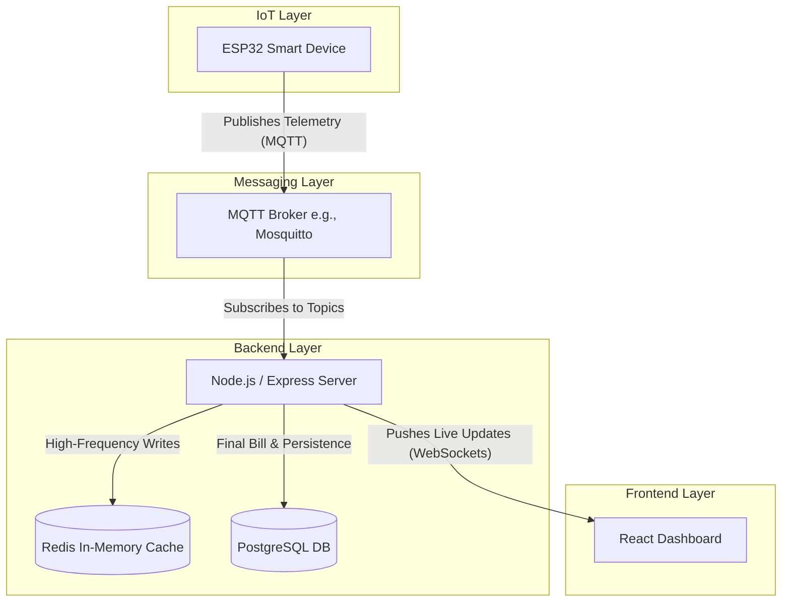

# FairAC Phase 3: Scaling Architecture

This document outlines the architectural upgrade path for the FairAC platform. While the current HTTP REST polling approach is perfect for prototyping and MVP validation, scaling the platform to hundreds or thousands of active smart devices and live dashboards requires a transition to persistent, event-driven protocols.

> [!NOTE]
> This document can be used as a blueprint. When you are ready to implement Phase 3, you can simply ask the AI to "Implement the upgrades outlined in phase_3_architecture.md".

## Current Architecture (Phase 1 & 2)

Currently, the system relies on **HTTP Polling**. 

- The **ESP32** sends a `POST /telemetry` request every 10 seconds.
- The **React Frontend** sends a `GET /sessions/active` request every 10 seconds to check for updates.
- The **PostgreSQL Database** processes a high volume of writes (telemetry updates) and reads (dashboard polls) every few seconds per active session.

While functional for a small number of devices, this creates massive HTTP overhead and database strain at scale.

## Phase 3 Architecture (The Upgrade)

The Phase 3 upgrade replaces the heavy HTTP polling layer with lightweight, real-time communication protocols. It introduces three key technologies: **MQTT**, **WebSockets**, and **Redis**.

---

### 1. MQTT for IoT Devices

**What is it?** 
MQTT (Message Queuing Telemetry Transport) is an ultra-lightweight messaging protocol designed specifically for IoT devices operating on constrained networks. 

**How it replaces HTTP:**
Instead of the ESP32 creating a brand new HTTP connection every 10 seconds (which requires DNS lookups, TCP handshakes, and heavy HTTP headers), the ESP32 opens a **single persistent connection** to an MQTT Broker when it boots up. 
It then simply "publishes" tiny data packets to specific topics (e.g., `fairac/telemetry/device_id`).

**Implementation Steps:**
1. Setup an MQTT Broker (like Eclipse Mosquitto or AWS IoT Core).
2. Update the ESP32 code to include the `PubSubClient` library.
3. Update the Node.js backend to use `mqtt.js` to subscribe to the telemetry topics.

> [!TIP]
> MQTT uses bytes instead of kilobytes per message. This will significantly reduce the bandwidth usage on the hostel's WiFi networks and allow a single server to handle tens of thousands of devices.

---

### 2. WebSockets for React Frontend

**What is it?**
WebSockets provide a full-duplex communication channel over a single TCP connection.

**How it replaces HTTP Polling:**
Currently, your React app asks the server "Is there new data?" every 10 seconds. With WebSockets (using a library like `Socket.io`), the React app opens a connection and quietly waits. When the server receives an MQTT message from the ESP32, the server instantly *pushes* the updated consumption numbers down the WebSocket directly to the React component.

**Implementation Steps:**
1. Install `socket.io` on the Node.js backend and `socket.io-client` on the React frontend.
2. When a student views the Dashboard or Session page, they join a specific "Socket Room" based on their `session_id` or `r_id`.
3. The backend emits `telemetry_update` events exclusively to users in that specific socket room.
4. React receives the event and updates the state instantaneously.

> [!IMPORTANT]
> This eliminates the 10-second lag entirely. The moment the ESP32 consumes a watt, the student's dashboard will tick upward within milliseconds.

---

### 3. Redis Caching for High-Frequency Data

**What is it?**
Redis is an in-memory data structure store, used as an extremely fast database cache.

**How it protects PostgreSQL:**
Relational databases like PostgreSQL are designed for persistence and complex relationships (billing, user accounts), not for constant, rapid-fire integer updates. Updating the `sessions.total_units` row every 10 seconds locks rows and fragments the database.

In Phase 3, we will write the live telemetry data to Redis. Redis operates entirely in RAM, so updating it 100,000 times a second is trivial. 

**Implementation Steps:**
1. Install Redis and the `redis` npm package on the backend.
2. When MQTT telemetry arrives, update the current consumption in Redis (`HSET session:84 units 0.233`).
3. Have a background cron job (or the End Session trigger) read the final value from Redis and write it permanently to PostgreSQL only when the session is over.

---

## Summary of Benefits

| Metric | Current (HTTP) | Phase 3 (MQTT + WS) |
| :--- | :--- | :--- |
| **Data Latency** | Up to 10 seconds | < 50 milliseconds |
| **Network Overhead** | Very High | Extremely Low |
| **Battery/Power on ESP32**| High | Low |
| **DB Write Operations** | Every 10s per device | Only at start/end of session |

By implementing this architecture in Phase 3, FairAC will transition from a functional prototype to an enterprise-grade IoT platform capable of deployment across entire university campuses.

---

## 4. Hardware & IoT Future Plans

Based on field requirements and robust edge-computing needs, the following hardware upgrades are planned for the ESP32 devices:

### 4.1 Offline Resilience (Push-Button Start)
In the worst-case scenario where the backend server or hostel internet is down, students should not be locked out of the AC. 
- **Implementation:** A physical push-button on the ESP32 hardware will allow manual override to power the AC. 
- **Data Logging:** The ESP32 will store the consumed electricity data locally (in NVS/SPIFFS/LittleFS).
- **Syncing:** Once the server connection is restored, the ESP32 will push the bulk offline usage data to the server (e.g., via `/api/v1/iot/offline-sync`) to correctly bill the student, ensuring zero revenue loss while maintaining high availability for users.

### 4.2 BLE WiFi Provisioning
Currently, WiFi credentials (SSID and password) are hardcoded into the ESP32 firmware. If a hostel owner changes their router or ISP, all devices would go offline and require manual reprogramming via USB.
- **Implementation:** Utilize the ESP32 `WiFiProv` (WiFi Provisioning via BLE) framework. 
- **User Experience:** Students or Admins can use a FairAC mobile app (or a web Bluetooth interface) to connect to the ESP32 via Bluetooth and securely transmit the new WiFi credentials. The ESP32 will save them to non-volatile memory, completely removing the need for hardcoded credentials.
